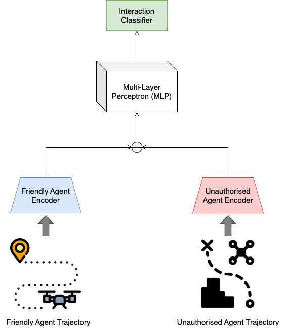
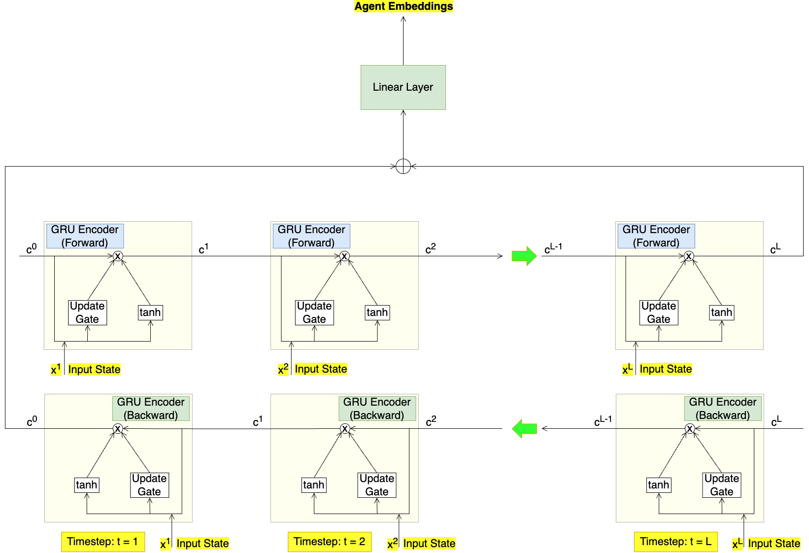

# Drone Interaction Classification (Dual-Encoder Bi-GRU)

This repository provides a **training pipeline** for classifying drone interaction types using a **dual-encoder Bi-GRU architecture**. The system processes multi-agent trajectory data and predicts interaction labels between agent pairs.

---

## ⚙️ Model Architecture

### 🔷 Dual-Encoder Classifier (Full Model Overview)

This architecture independently encodes the trajectories of two agent types using **Bi-GRU encoders**.  
Their embeddings are then combined and passed into a classifier to predict the interaction type between the agent pair.

> **Figure 1. Dual-Encoder Interaction Classifier**  
> *(High-level overview of the full model)*



---

### 🔷 Bi-GRU Encoder (Per-Agent Trajectory Encoder)

Each encoder processes a sequence of agent states (e.g., position, velocity) using a **Bi-directional GRU**.  
The final forward and backward hidden states are concatenated and projected into a fixed-size embedding vector.

> **Figure 2. Bi-GRU Encoder Architecture**  
> *(Structure of each encoder inside the dual-encoder model)*



---

## 📂 Directory Structure

```bash
.
├── scripts/
│   └── train.py                       # Main training script
│   └── inference.py                   # Inference script
│
├── traj_interact_predict/
│   ├── __init__.py
│   ├── data/
│   │   ├── data_loader.py             # Dataset loading & preprocessing
│   │   └── collate_fn.py              # Collation for variable-length agent data
│   │
│   ├── models/
│   │   ├── bi_gru_encoder.py          # Bi-GRU trajectory encoder
│   │   └── dual_encoder_classifier.py # Dual-encoder classifier
│   │
│   └── utils/
│       ├── train_utils.py             # Training, evaluation, scoring utilities
│       └── logger.py                  # Logging + experiment folder setup
│
├── notebooks/                         # Jupyter notebooks for analysis & experiments
│   └── (exploratory analysis)
│
├── tests/                             # Unit tests for models, data pipeline, utils
│   └── (pytest-based test files)
│
├── experiments/                       # Auto-generated experiment folders
│   ├── 20251120_113146/
│   │   ├── checkpoint.pt
│   │   ├── best_model.pt
│   │   ├── last_model.pt
│   │   ├── config.json
│   │   └── train.log
│
├── requirements.txt
└── README.md
```

---

## 🧱 Environment Setup

It is recommended to use a conda environment.

```bash
# Create and activate the environment
conda create -n traj_interact python=3.10
conda activate traj_interact

# Install dependencies
pip install -r requirements.txt

# Install Git Large File Storage (Git LFS)
git lfs install

# Pull large files tracked by Git LFS (e.g., datasets)
git lfs pull
```

---

## 🔁 Training (`train.py`)

The training pipeline:

1. Loads trajectory and relationship datasets from CSV files
2. Generates agent-pair samples
3. Extracts embeddings using a **Bi-GRU encoder** for each agent
4. Feeds the embeddings into a **dual-encoder classifier**
5. Trains with validation monitoring and optional early stopping
6. Saves:
   - `best_model.pt`
   - `last_model.pt`
   - `checkpoint.pt`
   - `config.json`
   - `train.log`
7. Performs final test-set evaluation

---

## ⚙️ Configuration

Key parameters inside `train.py`:

```python
BATCH_SIZE = 32     # Number of samples per training batch
EPOCHS = 50         # Total training iterations over the full dataset
LR = 1e-3           # Learning rate for the optimizer
VAL_SPLIT = 0.15    # Percentage of data reserved for validation during training
TEST_SPLIT = 0.15   # Percentage of data reserved for final testing
MAX_AGENTS = 6      # Maximum number of agents considered per sample for interaction prediction
LOOKBACK = 50       # Number of past trajectory timesteps used to classify interactions
```

Encoder parameters:

```python
encoder_params = {
    "input_size": 6,
    "enc_hidden_size": 64,
    "embedding_dim": 64,
    "num_layers": 1,
}
```

---

## ▶️ Running Training

To start a new training run:

```bash
python -m scripts.train
```

A new folder is automatically created inside `experiments/`:

```bash
experiments/20251120_103050/
```

This folder contains all saved models, logs, and configuration files for that run.

---

## 🔁 Resuming Training

To resume training from a previous experiment checkpoint, set in `train.py`:

```python
RESUME_TRAINING = True
exp_dir = "experiments/20251119_184413"
RESUME_CHECKPOINT = os.path.join(exp_dir, "checkpoint.pt")
```

This restores:

- Model weights
- Optimizer state
- Epoch number
- Training progress

Training continues automatically from the saved checkpoint.

---

## 📊 Evaluation

After training completes, the script:

- Evaluates on the test set
- Computes classification metrics (accuracy, precision, recall, F1)
- Logs results to `training.log`
- Stores experiment configurations in `config.json`

All outputs are saved inside the experiment folder.

---

## 🔍 Inference

### ⚙️ Inference Configuration

The inference script supports an optional parameter:

- **agents_to_pad**: List of agent indices to be zero-padded during inference to simulate fewer agents.

> Agents with indices 0 to 2 are friendly agents, and agents with indices 3 to 5 are unauthorized agents.

---

### **Examples:**

- Pad agents 0, 2, and 4:

```python
agents_to_pad = [0, 2, 4]
```

- Use all agents (no padding):

```python
agents_to_pad = None
```

---

### ▶️ Running Inference (`inference.py`)

Run inference with:

```bash
python -m scripts.inference
```
